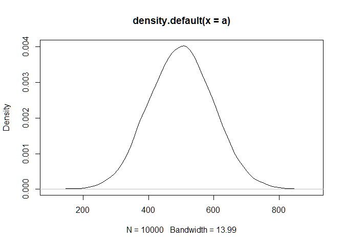
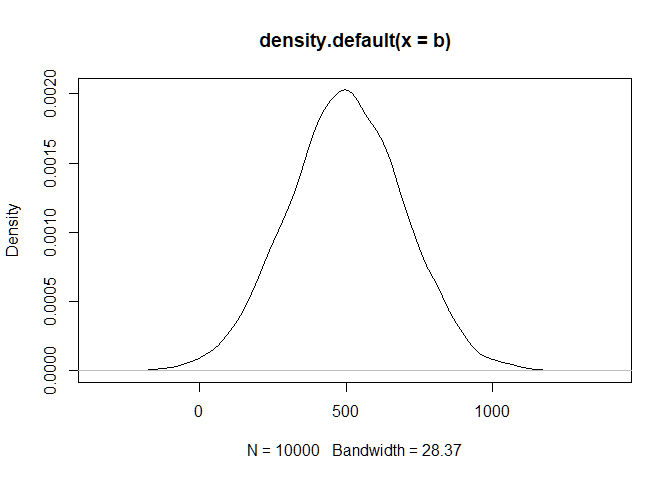
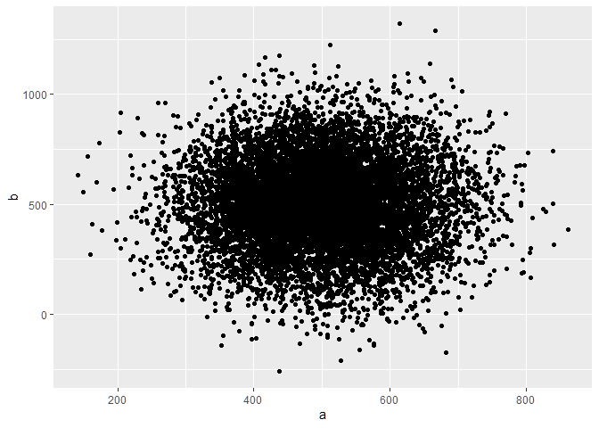

first steps
================
Tim
13 10 2020

# Header big

## Header small

``` r
a <- rnorm(1e4, 500, 100)
```

Create a vector.
<!-- -->

Plot said vector.

``` r
b <- rnorm(1e4, 500, 200)
```

Create another vector.
<!-- -->

Plot that vector.
<!-- -->

Combine vectors, plot b as a function of a.
